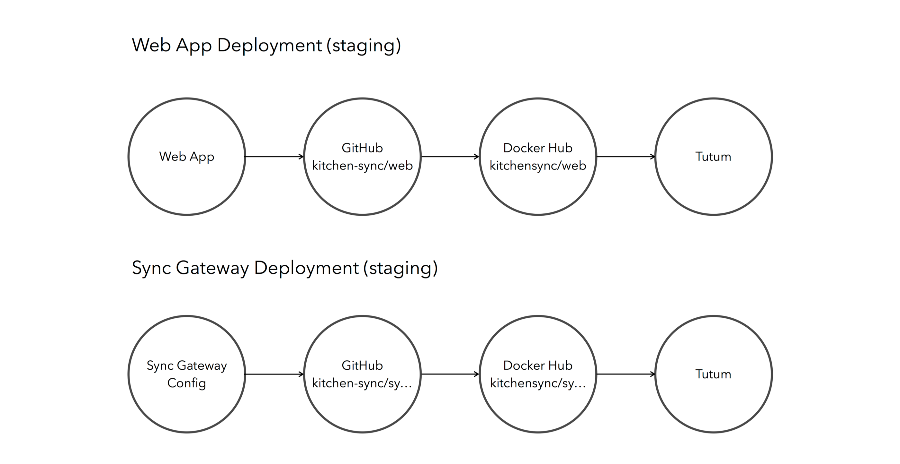
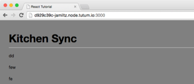
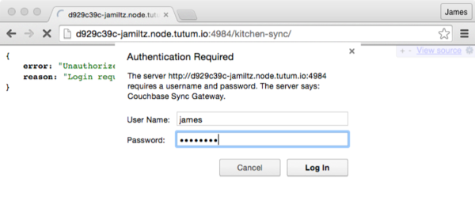
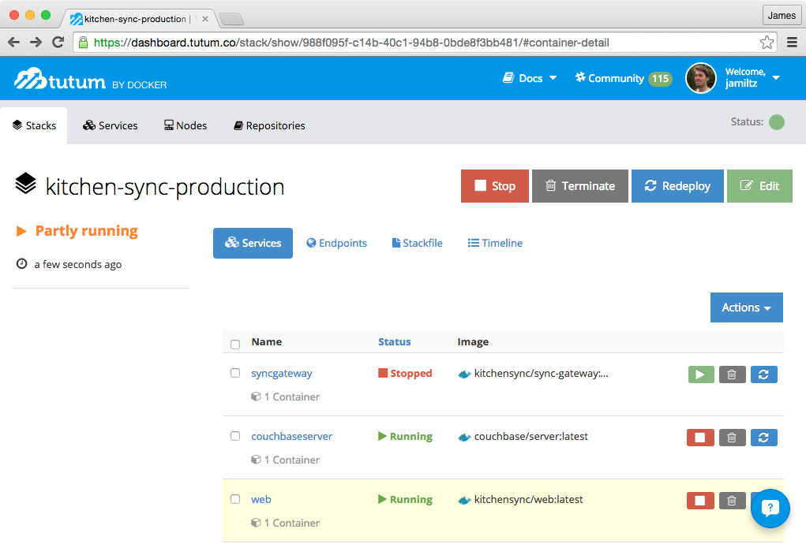
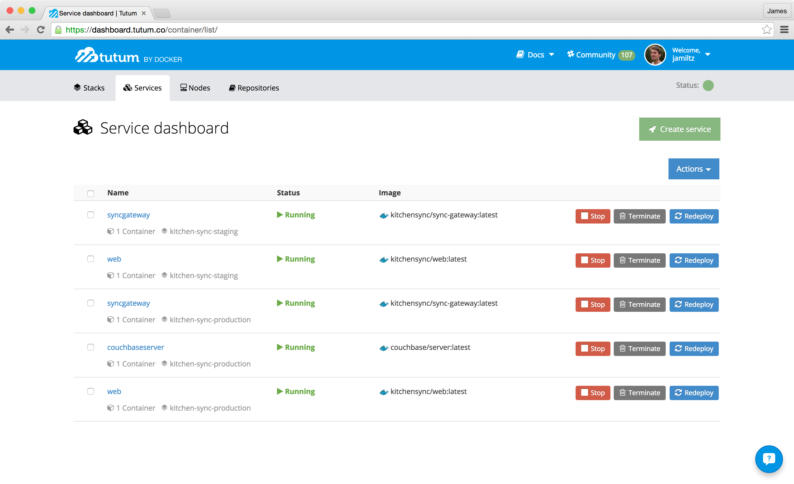

# Continuous Deployment for the Couchbase Mobile stack with Compose, Docker Hub and Tutum

The Couchbase Mobile stack in it's simplest form consists of 3 components that are shown in the diagram below:


**Couchbase Lite** is a NoSQL mobile database that persists data in JSON and binary format.
**Sync Gateway** is the middleman server that exposes a database API for Couchbase Lite databases to replicate to and from (data is not persisted in Sync Gateway).
**Couchbase Server** is a NoSQL server that's used as a storage engine by Sync Gateway.

**NOTE:** You can use Couchbase Lite as an embedded database only without the sync capabilities.

In this stack, each component has a clear responsibility and can greatly reduce the time it takes to build a suit of applications (Android, iOS, Web...) without compromising on the user experience because the user's data is automatically synched to Couchbase Lite in the background.

From a deployment standpoint it may look like a nightmare (especially if you are not a DevOpsy person!) but thanks to the Docker Toolbox and Tutum (now part of Docker!), you can continuously deploy each component individually with a simple **git push**. Here are the core concepts that you will learn in this tutorial:

- Basic Docker commands for Sync Gateway
- The development environment with Docker Compose and code sharing on GitHub
- Adding more components (here, a Web App) in the lifecycle of the project
- Setting up the Docker Hub repositories
- Continuously Deploying with Tutum

The release pipeline will look like this:


## Getting Started with Docker

If you are new to Docker, be sure to follow [this guide](https://docs.docker.com/mac/step_one/) to install the Docker Toolbox. It will install a number of other tools such as Docker Machine and Docker Compose that we will need later. Use the **Docker Quickstart Terminal** application from the Launchpad on Mac OS X, this will start a new VM with Virtual Box, configure it as a Docker Host and open a new Terminal window:


Make a note of the IP address of the Docker host that got automatically printed to the Terminal window as you will need it later. Run `docker -v` and `docker-compose` to make sure the binaries were installed correctly.

If you try to run `docker ps` (the command to list all containers) nothing happens and that's because you need to tell Docker to connect to the Docker machine you created above. Docker uses environment variables for this, run `eval "$(docker-machine env default)"` and then run `docker ps` again which should work this time. 

The great thing about using Docker in your development environment is that you don't need to install your application dependencies on your host machine. They can reside in a Docker container running the application. Declaring the dependencies to be used in a Docker container is done in the Dockerfile and luckily for us there are official repositories on Docker Hub for [Sync Gateway](https://hub.docker.com/r/couchbase/sync-gateway/) and [Couchbase Server](https://hub.docker.com/r/couchbase/server).

In the same Terminal window, create a new directory called **sync-gateway-docker** and inside that folder create a new **sync-gateway-config.json** file with the following:

```js
{
  "log":["*"],
  "verbose": true,
  "databases": {
    "kitchen-sync": {
      "server":"walrus:.",
      "users": {"GUEST": {"disabled": false, "all_channels": ["*"], "admin_channels": ["*"]}},
      "sync":`
        function(doc) {
          channel(doc.channels);
        }`
    }
  }
}
```

You're creating a database called **kitchen-sync** and using the **Walrus** mode which means that all the documents are stored in memory. This is especially convenient in development when you are testing the functionalities of your app and don't need a Couchbase Server running to persist data. In the directory where you created the config file, start Sync Gateway in a Docker container:

```bash
$ docker run -v '~/sync-gateway-docker/:/' -p 4984:4984 couchbase/sync-gateway /sync-gateway-config.json
```

Here's what is happening:

- **v**: The v flag stands for volume. You're mounting the current directory of the host which contains the config file in the root directory of the container.
- **p**: You're mapping port 4984 of the container to the same value in the docker host (your machine).
- **couchbase/sync-gateway**: The name of the image hosted on Docker Hub to run (see official [couchbase/sync-gateway](https://hub.docker.com/r/couchbase/sync-gateway/) page).
- **/www/sync-gateway-config.json**: The path to the config file you mounted in the container.

Now open a new browser window at **http://192.168.99.100:4984** (replace the IP address if yours is different). You should see the Sync Gateway welcome message:


Hooray! You've got your first Sync Gateway container running. In the next section, we'll introduce a few more components (Couchbase Server and a Web App) that will each run in different containers. But first, you need to grab some source code so fire up your Git!

## Code sharing on GitHub

To keep it simple, I have already published the code of the different components under the **Kitchen-Sync** GitHub organisation. There are 3 repositories:

- [sync-gateway](https://github.com/Kitchen-Sync/sync-gateway) contains the configuration file to pass to Sync Gateway instances.
- [web](https://github.com/Kitchen-Sync/web) is a simple Web App built with ReactJS on the front-end and a Node.js web server that connects to the Sync Gateway REST API.
- [development](https://github.com/Kitchen-Sync/development) ties all of the components together in the same directory as submodules. There is also a `README.md` and `docker-compose.yml` file that will help us start all the different components very easily.

In a new directory, run the following commands:

```bash
$ git clone git@github.com:Kitchen-Sync/development.git Kitchen-Sync
$ cd Kitchen-Sync
$ git submodule init
$ git submodule update
```

### How-To

To do the same for your project, head over to the [New Organization](https://github.com/organizations/new) page and create the different repositories as needed in your application. Don't forget to create the entrypoint repository (called **development**) that will reference the other application components as submodules.

```bash
$ git clone git@github.com:<project>/development.git <project>
$ cd <project>
```

Next you can add each application repository as a submodule:

```bash
$ git submodule add git@github.com:<project>/sync-gateway-config.git
$ git submodule add git@github.com:<project>/web.git
```

Now, if you commit and push to GitHub, the development repository will reference the submodules as well:


## Docker Compose for development

Now that you have the source code for the Web App and the Sync Gateway configuration file nicely organized you can start using Docker Compose to orchestrate and manage different Docker containers. Open `docker-compose.yml` and let's have a look:

```yaml
web:
  build: ./web
  ports:
    - '3000:3000'
  links:
    - syncgateway
syncgateway:
  build: ./sync-gateway-config
  command: /development.json
  ports:
    - '4984:4984'
```

The first container image is called **web** and is built directly out of the **web** directory. That's because there is a **Dockerfile** inside of that directory to that describes the steps to build the image. We won't cover [Dockerizing applications](https://docs.docker.com/userguide/dockerizing/) in this tutorial but it's crucial that you understand how it works because unless you use an image that is already published to Docker Hub, you will need to Dockerize your application components to get Continuous Delivery set up correctly. The second container is called **syncgateway** and is using also building the container image from the **sync-gateway-config** directory. If you open **sync-gateway-config/Dockerfile** you will that it's based on the official [couchbase/sync-gateway](https://hub.docker.com/r/couchbase/sync-gateway/) image and mounts the direct config files in the container. The options specified are the same as the one you specified in the `docker run` in the first section of this tutorial.

Run this command to start both containers:

```bash
$ docker-compose up
```

Notice how the logs from Sync Gateway (in blue) and from the Web App (in yellow) are aggregated. This is a huge win for productivity during development as you don't have to switch between different Terminal tabs.


Next, open **http://192.168.99.100:3000** (replace the IP address if yours is different) and start adding items. Items are persisted to Sync Gateway, reloading the page will fetch the documents from Sync Gateway:


Well done! You've decoupled the Sync Gateway configuration file from the Web App in the source code but the development experience remains streamlined and simple with Docker Compose.

## Docker Hub

**NOTE:** To reproduce the steps below with your own Docker Hub and Tutum accounts you will need to be a member of the [Kitchen-Sync](https://github.com/Kitchen-Sync) organization. Ping me your GitHub username on [Twitter](http://twitter.com/jamiltz) or try the following with your own application components.

Remember how `docker-compose.yml` builds the image for the container named **web** from the local directory? Well, that's perfect during development because you can change the source and simply run `docker-compose up` again. For production deployments however, we need to have a shared image that can be pulled by services such as Tutum. Docker Hub is the perfect tool to host container images online so head over to [hub.docker.com](http://hub.docker.com) and do the following:

1. Click the **Organizations** tab and create a new organization named **KitchenSync** (you may have to append characters to ensure uniquness of the name as it will already exist on Docker Hub)

Create a new repository with the following steps:

1. Click **Add Repository** > **Automated Build**
2. You will be prompted to link your GitHub account and after doing so you will see the list of organizations and repositories
3. Select the repository named **web** from the **Kitchen-Sync** GitHub organization (only visible if you are a member of the **Kitchen-Sync** organization) and the following page will appear:


1. Make sure to choose the organization name from the dropdown menu
2. Check "When active we will build when new pushes occur"
3. Click **Create Repository**

You checked the option in step 3 so you can trigger a new build when a developer from the team has pushed new commits on the **master** branch. The new repository can be found at [https://hub.docker.com/r/kitchensync/web/](https://hub.docker.com/r/kitchensync/web/).

Next, you can push the source code of your application component:

 

And see the action in the **Build Details** tab of the Docker Hub repository:


### Sync Gateway Repository

The same process applies to the Sync Gateway container. Create a new automated build repository on Docker Hub called **kitchensync/sync-gateway** that's linked to the **kitchen-sync/sync-gateway-conig** GitHub repository.

## Tutum

For this section, you're going to use Tutum.

### Creating a node cluster ready for Docker deployment

1. Create an account on Tutum and sign in
2. Go to **Account info** > **Cloud providers** and connect the providers of your choice
3. Under the **Nodes** tab, click **Launch new node cluster**
4. Select a cluster name (e.g. KitchenSyncStaging), a deploy tag (e.g. kitchen-sync-staging) server type and cluster size (one should be enough for this example) then click **Launch node cluster**


At this point, you should have your server(s) ready for production and reachable on a node.tutum.io sub-domain (in my case it's [d929c39c-jamiltz.node.tutum.io](http://d929c39c-jamiltz.node.tutum.io)).

## Deploying the application stack

Time to use a production-ready version of the application: the Docker image built by Docker Hub. Remember I told you the `docker-compose.yml` will come handy? To deploy our application, we’re gonna use Tutum Stacks, which are YAML files very similar to Docker Compose files.
Here's the `tutum-staging.yml` we’re going to use:

```yaml
web:
  image: kitchensync/web
  ports:
    - '3000:3000'
  links:
    - syncgateway
  tags:
    - kitchen-sync-staging
syncgateway:
  image: kitchensync/sync-gateway
  command: /development.json
  ports:
    - '4984:4984'
  tags:
    - kitchen-sync-staging
```

Here, you're specifying the path to `development.json` which was mounted in the root directory of the container as per the Dockerfile published on the [Kitchen-Sync/sync-gateway-config](https://github.com/Kitchen-Sync/sync-gateway-config/) GitHub repository.

Now we have our `tutum-staging.yml` and both the Web App and Sync Gateway images on Docker Hub, let's deploy:

1. Under the **Stacks** tab, click on **Create your first stack**
2. Set a name for your stack (e.g. kitchen-sync-staging)
3. Paste the content of your **tutum-staging.yml** in the Stack file textarea
4. Click on **Create and deploy**

Wait for both services to be up:


And open your tutum node subdomain on port 3000:


**Congratulations!** You just deployed your application. We now want to automatically redeploy our application services whenever there is a new commit pushed to GitHub.

## Continuous Deployment

Before we get into the specifics let's review the different services to continuously deploy:



As you can see, the Web App source code is always built as a new Docker image on Docker Hub before being deployed with Tutum. Similarly for Sync Gateway, a new Sync Gateway image is published on Docker Hub when a change is made to one of the config files (`development.json` or `production.json`).

### Continuously Deploy your Web App

The same way we triggered the Docker Hub build from GitHub, we are going to trigger a Tutum Redeploy from Docker Hub when a new image is successfully published.

1. From the **Services** tab, click on the service named **web**
2. Go to the **Triggers** tab and add a redeploy trigger named Docker Hub
3. Refresh the page and copy the trigger URL
4. Go back to your Docker Hub repository page, then click on **Settings > Webhooks**
5. Add a webhook calling the trigger URL you just copied

Now, push some edits to your repository and follow your application as it goes through your deployment pipeline:

Development→ GitHub → CircleCI → Docker Hub → Tutum → Production

I've updated the background color to grey, pushed it to GitHub and the change is reflected on the staging Tutum node soon after:



### Continuously Deploy Sync Gateway

Again, the same concept applies to deploy the **syncgateway** service. Create a Redeploy Trigger in Tutum and copy the URL to a new WebHook in Docker Hub for the repository **kitchensync/sync-gateway**. To check that it's working I'm going to push an update to `development.json` with the following:

```js
	...
	"users": {"james": {"password": "letmein", "all_channels": ["*"], "admin_channels": ["*"]}},
	...
```

Here, we've replace the GUEST user with a real user. As a result, the browser should prompt us to log in with a user's name and password. Run the commands `git commit -am "update dev config"` and `git push`. Then head over to the Tutum node at **http://{your-node-hostname}:4984/kitchen-sync** and surely enough, we are prompted to login!



## Adding a Production node

Having Continuous Deployment is especially convenient for the staging environment to test and share feature updates with other team members. When it comes to production, you can decide to use Continuous Deployment or do it manually. To wrap up this tutorial, we'll cover the manual approach. Head back to the Tutum website and create a new Node with a **Tag** called **kitchen-sync-production**. Then, create a new Stack with the following (from `tutum-production.yml`):

```yaml
web:
  image: kitchensync/web
  ports:
    - '3000:3000'
  links:
    - syncgateway
  tags:
    - kitchen-sync-production
syncgateway:
  image: kitchensync/sync-gateway
  command: /production.json
  ports:
    - '4984:4984'
  tags:
    - kitchen-sync-production
couchbaseserver:
  image: 'couchbase/server'
  ports:
    - '8091:8091'
  tags:
    - kitchen-sync-production
```

There are 3 differences with the Tutum file you used previously for the staging server:

- The specified tag is now **kitchen-sync-production**
- The syncgateway command option now points to the production configuration file
- You're adding a new service called couchbaseserver to persist the data!

Click **Create Stack** and wait for the services to come up. The **syncgateway** service should fail because you need to create a user and bucket in Couchbase Server first:



In Tutum, select the **couchbaseserver** service and click on the running image then on the **Terminal** tab which will open a new session in this container. Run the following commands:

```
# /opt/couchbase/bin/couchbase-cli cluster-init -c 127.0.0.1 --cluster-init-username=Administrator --cluster-init-password=password --cluster-init-ramsize=600 -u admin -p password
# /opt/couchbase/bin/couchbase-cli bucket-create -c 127.0.0.1:8091 --bucket=default --bucket-type=couchbase --bucket-port=11211 --bucket-ramsize=600 --bucket-replica=1 -u Administrator -p password
```

Then, try restarting the **syncgateway** service and this time it should work.

## Where To Go From Here

On the services tab you should see all the different application components running:



Well done! You've successfully deployed a staging and production environment for the Couchbase Mobile stack. In addition, you now have continuous deployment running on the staging server which will make everyone happier in your team and increase productivity 10x!